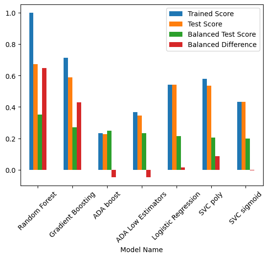
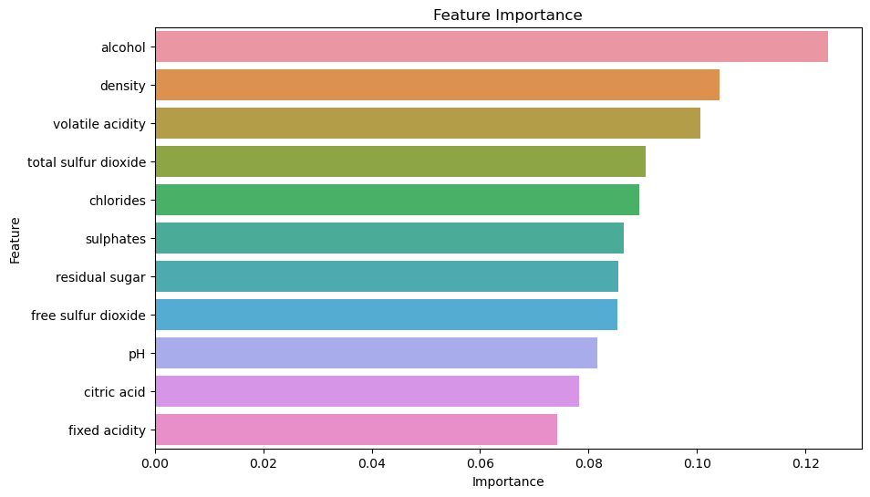
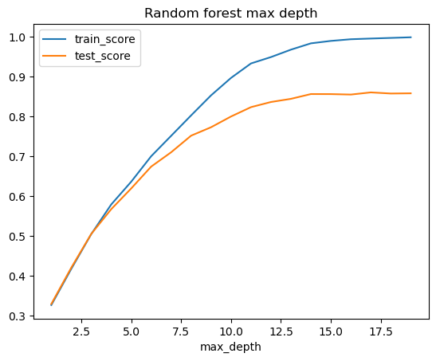
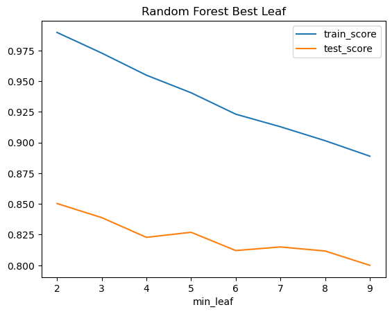
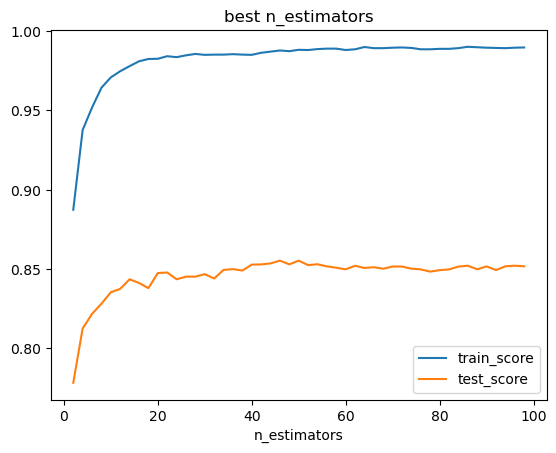
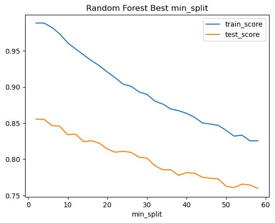
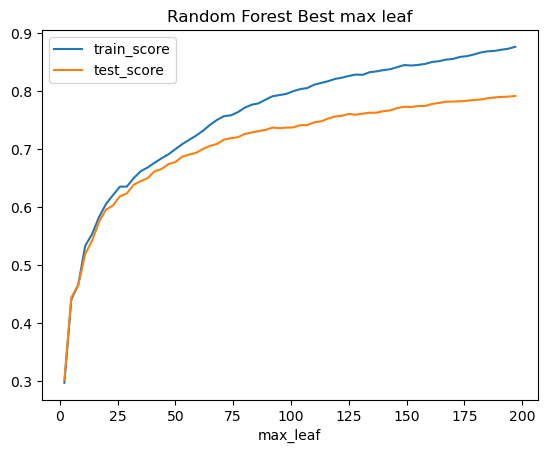
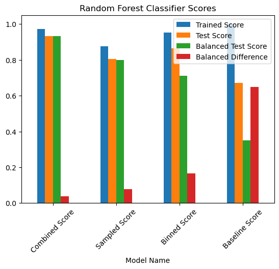

# group-project-2

# Objective: 
We are predicting the quality of red and white wines from the north of portugal, using machine learning techniques.  We will use the UCI data sets to improve our model, and our ability to predict the quality of the wines. We are analysing the data looking for a specific outcome of good or bad quality.  (Based on expert reveiws) 

# Resources-Data set summary.  
The two datasets are related to red and white variants of the Portuguese "Vinho Verde" wine. For more details, consult: http://www.vinhoverde.pt/en/ or the reference [Cortez et al., 2009].  Due to privacy and logistic issues, only physicochemical (inputs) and sensory (the output) variables are available (e.g. there is no data about grape types, wine brand, wine selling price, etc.).

# Project Overview:
This project aims to predict the quality of wine based on various chemical properties using machine learning techniques. The wine quality dataset from the UCI machine learning repository is analyzed and processed. 

The goal is to build a robust predictive model to classify wine quality ratings acording to scientific standards.

# Target variable:
Our goal target variable is "quality" to determine if a wine will be rated good or bad. Thresholds were assigned by choice based on a 3 to 9 scale, we decided to use 6 to 7 to error on ratings being higher based on 5 and 6 having the highest data counts.  We wanted the mediocre wines to be qualified as "bad".

# Other Version?
# Target Variable:
Our target variable is 'quality', which aims to determine if a wine will be rated good or bad. The quality ratings in our data set range from 3 to 9. To classify the wines, we chose a threshold where wines rate 6 and above are considered 'good', while those rated below 6 are considered 'bad'. This decision was based on the distribution of the ratings where, 5 and 6 had the highest counts. By setting this threshold, we ensure that wines rated as mediocre are classified as 'bad', allowing us to focus on distinguishing the higher quality wines frome the rest.

# Requirements:
- python  
- pandas  
- sklearn  
	- metrics  
		- accuracy_score  
		- balanced_accuracy_score  
		- classification_report  
	- model_selection  
		- train_test_split  
	- utils  
		- resample  
	- preprocessing  
		- StandardScaler  
	- ensemble  
		- RandomForestClassifier  
		- LogisticRegression  
		- SVC  
		- GradientBoostingClassifier  
		- AdaBoostClassifier  
- matplotlib  
- seaborn  

License: UC Irvine Machine Learning Repository  
This dataset is licensed under a Creative Commons Attribution 4.0 International (CC BY 4.0) license.  
This allows for the sharing and adaptation of the datasets for any purpose, provided that the appropriate credit is given.  
DOI: 10.24432/C56S3T  
https://archive.ics.uci.edu/dataset/186/wine+quality  
archive.ics.uci.eduarchive.ics.uci.edu  
UCI Machine Learning Repository  
Discover datasets around the world!  

# Instructions 
1. Install the requirements

2. Run main.ipynb file

# Conclusion
We were sucessful in predicting to a 93.6% balanced accuracy score for our RandomForestClassifier tuned model.
Baseline and best score summary visualilaztion.

  

  

  

  
  
  
  
  
  
  
  
  
  
  

 

