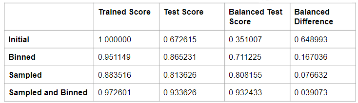

# group-project-2

We are predicting the quality of red and white wines from the north of portugal, using machine learning techniques.  We will use the UCI data sets to improve our model, and our ability to predict the quality of the wines. We are analysing the data looking for a specific outcome of good or bad quality.  (Based on expert reveiws) 

## Executive Summary
Our goal is to predict wine quality based on chemical properties using machine learning techniques. We implemented and optimized models to achieve high accuracy and provide insights into feature importance.

## Table of Contents

## Intrduction
We all liked to have a good glass of wine and noticed that there was a great deal of data out their having to do with wine quality. Once we looked more into the project we realized that there was plenty of room to expand it using region, grape type and even weather if time permitted.

Wine quality prediction is an important task in the wine industry, as it directly impacts consumer satisfaction and market success. By accurately predicting wine quality, producers and maintain high standards and consistency in their products.Our project aims to leverage machine learning techniques to predict wine quality based on various chemical properties of the wine.

## Resources-Data set summary.  
The two datasets are related to red and white variants of the Portuguese "Vinho Verde" wine. For more details, consult: http://www.vinhoverde.pt/en/ or the reference [Cortez et al., 2009].  Due to privacy and logistic issues, only physicochemical (inputs) and sensory (the output) variables are available (e.g. there is no data about grape types, wine brand, wine selling price, etc.).

## Data Collection and Cleaning
The methods we used for our collection, steps to clean and prepprocess data. How did we hadle the missing values and outliers?

## Exploratory Data Analysis
Our initial explorations in addition to any key insights or patterns that we found.

## Model Implementation
Overview of the machine learning models used, how we implemented them. Could add code snippets here for example of the model training

## Evaluation Metrics
Explain what were using like accuracy, balanced accuracy and other metrics.

## Feature importance 
Analysis of feature importance, this is where the visualization of the top features should go

## Future Work
Potential improvements or any next steps. I think this is where adding our weather data and region can go. Any other questions we might have.

## Conclusion

- The Initial model shows overfitting and poor handling of class imbalance.

- The Binned model shows significant improvement in generalization and handling of class imbalance.

- The Sampled model shows good performance and handles class imbalance well, with a very small balanced difference.

- The Sampled and Binned model shows the best overall performance, generalizing well to the test data and handling class imbalance effectively, with the smallest balanced difference.

- The Sampled and Binned model is the most robust and well-performing approach based on these metrics

  

  

  

  
  
  
  
  
  
  
  
  
  
  

 
## References
Data sets,tools used, any writings we might have

## Project Overview:
=======
### Project Overview:

This project aims to predict the quality of wine based on various chemical properties using machine learning techniques. The wine quality dataset from the UCI machine learning repository is analyzed and processed. 

The goal is to build a robust predictive model to classify wine quality ratings acording to scientific standards.

### Target Variable:
Our target variable is 'quality', which aims to determine if a wine will be rated good or bad. The quality ratings in our data set range from 3 to 9. To classify the wines, we chose a threshold where wines rate 6 and above are considered 'good', while those rated below 6 are considered 'bad'. This decision was based on the distribution of the ratings where, 5 and 6 had the highest counts. By setting this threshold, we ensure that wines rated as mediocre are classified as 'bad', allowing us to focus on distinguishing the higher quality wines frome the rest.

### Requirements:
- python  
- pandas  
- sklearn  
	- metrics  
		- accuracy_score  
		- balanced_accuracy_score  
		- classification_report  
	- model_selection  
		- train_test_split  
	- utils  
		- resample  
	- preprocessing  
		- StandardScaler  
	- ensemble  
		- RandomForestClassifier  
		- LogisticRegression  
		- SVC  
		- GradientBoostingClassifier  
		- AdaBoostClassifier  
- matplotlib  
- seaborn  

### License
License: UC Irvine Machine Learning Repository  

This dataset is licensed under a Creative Commons Attribution 4.0 International (CC BY 4.0) license.  
This allows for the sharing and adaptation of the datasets for any purpose, provided that the appropriate credit is given.  

DOI: 10.24432/C56S3T  

[https://archive.ics.uci.edu/dataset/186/wine+quality](https://archive.ics.uci.edu/dataset/186/wine+quality)

UCI Machine Learning Repository  

Discover datasets around the world!  

# Instructions 
1. Install the requirements

2. Run main.ipynb file

